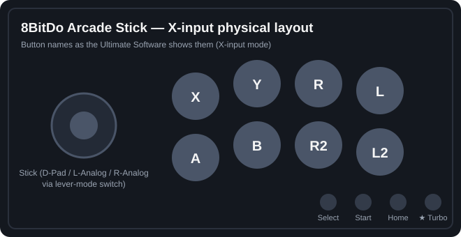
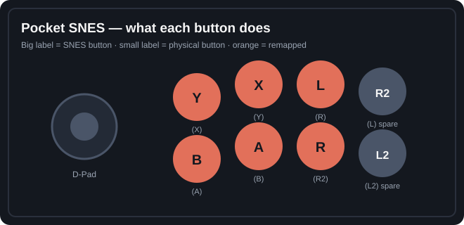
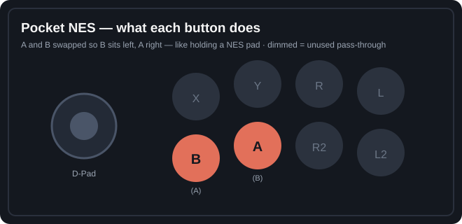
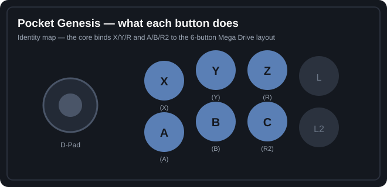
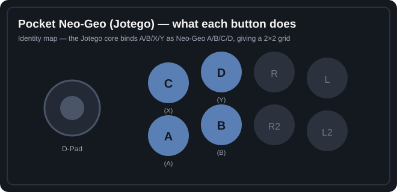

# 8BitDo Arcade Stick — Console Profiles

Ready-made **8BitDo Ultimate Software** profiles for the 8BitDo Arcade Stick, covering
Analogue Pocket openFPGA cores, the Analogue Duo, Analogue 64, PS2, PS3 and Xbox Series X.

Each profile is a plain `.ini` file that the Ultimate Software (v2.x) reads from its
`Config\ArcadeStick\Xinput\` folder — drop them in, restart the app, pick a profile, sync it
to the stick. Done.

All profiles assume the stick is in **X-input mode** and keep 8BitDo's stock extras:
the ★ button stays mapped to **Turbo**, and Home stays as the mode/home button.

## What's included

| Profile | Target | Mapping |
|---|---|---|
| `Pocket SNES.ini` | Analogue Pocket — SNES core | Face remapped to the classic SNES arcade layout (Y X L / B A R) |
| `Pocket NES.ini` | Analogue Pocket — NES core | A/B swapped so B sits left of A, like a NES pad |
| `Pocket Genesis.ini` | Analogue Pocket — Genesis core | Identity — rows fall onto X Y Z / A B C |
| `Pocket Neo-Geo.ini` | Analogue Pocket — Neo-Geo (Jotego core) | Identity — left 2×2 block gives A B / C D |
| `Pocket Master System.ini` | Analogue Pocket — Master System core | Identity — buttons 1 & 2 on the bottom row |
| `Analogue Duo.ini` | Analogue Duo | Identity, stick-click (L3/R3) disabled; A/B act as II/I |
| `Analogue 64.ini` | Analogue 64 | Identity — flip the lever switch to left-analog for the N64 stick |
| `PS2.ini` | PlayStation 2 (via adapter) | Identity — A B X Y → Cross Circle Square Triangle |
| `PS3.ini` | PlayStation 3 (Bluetooth) | Remapped for the PS3's index-based HID reading — [full technical write-up](docs/ps3-bluetooth-mapping.md) |
| `Xbox Series X.ini` | Xbox Series X (via adapter) | Identity — native Xbox layout |
| `Steam.ini`, `MAME.ini`, `PCE.ini` | PC | Original PC profiles, included for completeness |

## Requirements

- 8BitDo Arcade Stick (the 2021 Xbox-layout model, PID `36890` in these files)
- [8BitDo Ultimate Software](https://support.8bitdo.com/) v2.x for Windows
- For PS2 / PS3 / Xbox Series X you need a converter (e.g. Brook Wingman, 8BitDo USB adapter) —
  the stick itself only speaks Switch and X-input
- The Analogue consoles take the stick via their dock / USB in X-input mode

## Installing the profiles

1. **Find your Ultimate Software folder.** It's wherever you unzipped the software —
   inside it there's a `Config\ArcadeStick\Xinput\` folder (the software creates it the
   first time you save a profile with the Arcade Stick connected in X-input mode).
2. **Copy the `.ini` files** from this repo's [`profiles/`](profiles/) folder into
   `Config\ArcadeStick\Xinput\`.
3. **Restart the Ultimate Software** (run it as administrator, with the stick plugged in
   and its mode switch on **X**). The new profiles appear in the profile list, named
   after the files.
4. **Select a profile and sync it.** Open the button-mapping screen, pick the profile for
   the console you're about to play, and hit **Apply / Sync to device**. The mapping is
   stored on the stick itself, so it persists after you unplug from the PC.
5. **Plug the stick into the console** (or dock/adapter) and play.

> **Tip:** the stick only holds one mapping at a time — when you switch consoles, plug it
> back into the PC and sync the matching profile. It takes about ten seconds.

## The layouts

### Pocket SNES

Remapped so your index/middle/ring fingers land on Y·X·L and B·A·R — the standard
SNES-on-a-stick arrangement. The rightmost column carries the leftover triggers as spares.

### Pocket NES

Only two buttons matter; they're on the bottom row under your index and middle fingers,
with B on the left as nature intended.

### Pocket Genesis

No remapping needed — the stick's rows already match the 6-button Mega Drive pad once the
core binds them: top row X·Y·Z, bottom row A·B·C.

### Pocket Neo-Geo (Jotego)

The Jotego cores bind A/B/X/Y to Neo-Geo A/B/C/D, so the left 2×2 block becomes the
classic grid: A·B on the bottom, C·D on top.

### PS3 over Bluetooth

The PS3 pairs with the stick as a *generic* HID gamepad and ignores button names — it
reads buttons purely by report index, expecting the standard "PC/PS3" stick order:
`1 Square · 2 Cross · 3 Circle · 4 Triangle · 5 L1 · 6 R1 · 7 L2 · 8 R2 · 9 Select · 10 Start`.

The stick in X-input mode reports Xbox order (`A B X Y L R Select Start L3 L3/R3`, with the
triggers as axes the PS3 can't see). Left unmapped, that scrambles everything — physical
Start comes out as R2 and the P2 macro button becomes Start. So this profile remaps outputs
to land on the right indices:

| Physical | Output sent | PS3 sees |
|---|---|---|
| Top row X · Y · R · L | A · Y · R · L | Square · Triangle · R1 · L1 |
| Bottom row A · B · R2 · L2 | B · X · START · SELECT | Cross · Circle · R2 · L2 |
| Select / Start | L3 / R3 | Select / Start |
| P1 / P2 | L3 / R3 (default) | Select / Start (bonus duplicates) |

That gives the classic PS3 fight-game default: LP·MP·HP on Square·Triangle·R1 across the
top, LK·MK·HK on Cross·Circle·R2 along the bottom. The L2/R2 *outputs* are deliberately
avoided — as axes, they're invisible to the PS3.

For the complete derivation — both index tables, the before/after behavior, and an
annotated walkthrough of every `[Mappings]` line — see the
**[PS3 Bluetooth mapping deep-dive](docs/ps3-bluetooth-mapping.md)**.

### Everything else

The Duo, Analogue 64, PS2 and Xbox Series X profiles are identity maps — the console
(or adapter) already puts the buttons where you expect. The Duo profile additionally
disables the stick-click inputs (L3/R3) since the PC Engine has no use for them and a
bumped stick shouldn't press ghost buttons.

## Tweaking

Every mapping here is a starting point. If a core feels wrong (button assignments differ
between Pocket cores and firmware versions), fix it in the Ultimate Software:

1. Load the profile.
2. Click the on-screen button you want to change and pick a new output.
3. **Save** the profile, then **Sync** it to the stick.

The `.ini` files are human-readable too — `[Mappings]` is simply `physical=output`, and
`=N` disables a button.

## Turbo

The ★ button next to Home is the hardware Turbo control in all profiles: hold ★ and tap a
button to toggle turbo on it; hold ★ and tap it again to clear. Handy for shmups on the
Genesis and Neo-Geo cores.

## stickctl (experimental)

[`stickctl/`](stickctl/) is a command-line tool that talks the stick's config protocol
directly over USB HID — read, decode and capture the on-stick mapping without the
Ultimate Software GUI, as the groundwork for a fast one-command profile switcher. The
protocol (reverse-engineered from `8BitDoAdvance.dll`) is documented in
[docs/protocol.md](docs/protocol.md).

## License

[MIT](LICENSE) — use, copy, and adapt these profiles freely.
