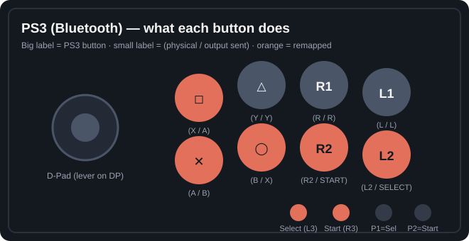

# PS3 over Bluetooth — how `PS3.ini` works, in detail

This page explains why the stock (identity) mapping scrambles buttons when the 8BitDo
Arcade Stick is paired to a PlayStation 3 **directly over Bluetooth**, and exactly how
[`profiles/PS3.ini`](../profiles/PS3.ini) compensates. Everything below was verified on
real hardware (stick firmware paired in X-input mode, connection switch on **BT**).



## The pipeline

```
┌─────────────────┐  Bluetooth HID   ┌──────────────────────────┐
│ 8BitDo Arcade    │ ───────────────▶ │ PS3                      │
│ Stick (X mode)   │  button bitmap   │ generic-HID pad driver   │
│                  │  by INDEX        │ maps INDEX → DS3 button  │
└─────────────────┘                  └──────────────────────────┘
        ▲
        │ [Mappings] in the synced profile decide
        │ which OUTPUT (= which report index) each
        │ physical button fires
```

Three facts combine to cause the scramble:

1. **The stick has no PS3 mode.** Its two firmware personalities are Switch (S) and
   X-input (X). Over Bluetooth in X mode it presents as a standard HID gamepad whose
   report is laid out in *Xbox* button order.
2. **The PS3 ignores button usages/names.** Its generic-HID pad driver assigns meaning
   purely by *report index*, using the de-facto "PC/PS3 stick" convention that every
   licensed/clone PS3 arcade stick follows.
3. **The stick's triggers are analog axes** in X mode, not buttons. The PS3's pad driver
   reads only the button bitmap and the hat switch — axis triggers are invisible to it.

## The two index tables

What the stick sends (X-input mode over Bluetooth, DirectInput view):

| Report index | Stick output |
|---|---|
| 1 | A |
| 2 | B |
| 3 | X |
| 4 | Y |
| 5 | L (LB) |
| 6 | R (RB) |
| 7 | SELECT (Back) |
| 8 | START |
| 9 | L3 |
| 10 | R3 |
| — | L2 / R2 → analog axes, **not** buttons |
| hat | D-Pad (joystick in DP mode) |

What the PS3 expects at each index (standard PS3-stick order):

| Report index | PS3 reads |
|---|---|
| 1 | Square |
| 2 | Cross |
| 3 | Circle |
| 4 | Triangle |
| 5 | L1 |
| 6 | R1 |
| 7 | L2 |
| 8 | R2 |
| 9 | Select |
| 10 | Start |
| hat | D-Pad |

Composing the two tables gives the *unfixed* behavior — what an identity profile
produces, and exactly what was observed before the fix:

| You press | Stick sends index | PS3 thinks |
|---|---|---|
| A | 1 | Square |
| B | 2 | Cross |
| X | 3 | Circle |
| Y | 4 | Triangle |
| L | 5 | L1 |
| R | 6 | R1 |
| **Select** | 7 | **L2** |
| **Start** | 8 | **R2** ← "start isn't start" |
| **P1** (default output L3) | 9 | **Select** |
| **P2** (default output R3) | 10 | **Start** ← "P2 is start" |
| L2 / R2 | axis | *nothing* |

## Aside: the ini's `L3`/`R3` keys are the P1/P2 buttons

The Arcade Stick has no clickable sticks. Its 18 mappable inputs are the 8 face buttons,
4 directions, Select, Start, Home, ★ (Share/turbo), and the two **P1/P2 macro buttons** —
and in the Ultimate Software ini format, P1 and P2 are stored under the `L3` and `R3`
keys. Their factory default is to emit the L3/R3 outputs (report indices 9 and 10),
which is precisely why P2 turned into Start on the PS3. (`=N` disables a button — the
Analogue Duo profile uses that.)

## Deriving the fix

The goal: make each *physical* button emit the report index the PS3 associates with the
button we actually want. Working backwards from the PS3 table:

- **PS3 Select is index 9, Start is index 10** → physical Select must emit the `L3`
  output, physical Start the `R3` output.
- **PS3's face buttons are indices 1–4** (`A B X Y` outputs) → distribute those four
  outputs so the face forms the standard PS3 fight layout — Square·Triangle·R1 for
  punches on top, Cross·Circle·R2 for kicks below (the Street Fighter console default).
- **PS3 L2/R2 are indices 7/8** — which the stick only reaches via its `SELECT` and
  `START` outputs. So the two right-column face buttons emit `SELECT` and `START`.
  Counter-intuitive in the ini, correct on the console.
- **The `L2`/`R2` outputs are never assigned** — they're axes, dead weight on PS3.
- **P1/P2 keep their defaults**, giving handy duplicate Select/Start on the top edge.

The resulting `[Mappings]` block, annotated:

```ini
[Mappings]
X=A            ; top row 1   -> index 1  -> Square
Y=Y            ; top row 2   -> index 4  -> Triangle
R=R            ; top row 3   -> index 6  -> R1
L=L            ; top row 4   -> index 5  -> L1
A=B            ; bottom 1    -> index 2  -> Cross
B=X            ; bottom 2    -> index 3  -> Circle
R2=START       ; bottom 3    -> index 8  -> R2
L2=SELECT      ; bottom 4    -> index 7  -> L2
SELECT=L3      ; Select      -> index 9  -> Select
START=R3       ; Start       -> index 10 -> Start
L3=L3          ; P1 (macro)  -> index 9  -> Select (duplicate)
R3=R3          ; P2 (macro)  -> index 10 -> Start (duplicate)
Up=Up          ; joystick on DP -> hat switch -> D-Pad
Left=Left
Right=Right
Down=Down
Share=turbo    ; ★ stays the hardware turbo modifier
Home=switchHome
```

(Order shuffled here for readability; the real file lists the keys in the software's
own order. Duplicate outputs are legal — the ini format allows many-to-one.)

## Final layout on the PS3

```
        Square  Triangle  R1  L1
        Cross   Circle    R2  L2

Select = Select button   Start = Start button
P1 = Select (dup)        P2 = Start (dup)
Joystick = D-Pad (lever switch on DP)
```

## Practical notes

- **Sync required:** editing the ini does nothing by itself. Cable the stick, open the
  Ultimate Software, load the PS3 profile, Apply/Sync. The mapping lives in the stick's
  own memory afterwards — no PC needed at the console.
- **Pair in X mode.** These indices are the X-mode report layout. S (Switch) mode uses a
  different protocol and won't behave the same.
- **Keep the lever switch on DP.** The PS3 driver reads the hat switch; the LS/RS
  analog positions won't register as directions in most PS3 games.
- **No pressure sensitivity, no Home:** the PS3's generic-HID path has no PS-button or
  sixaxis support, so you can't wake the console or open the XMB with the stick's Home
  button. Turbo (★) still works — it's handled inside the stick, upstream of all this.
